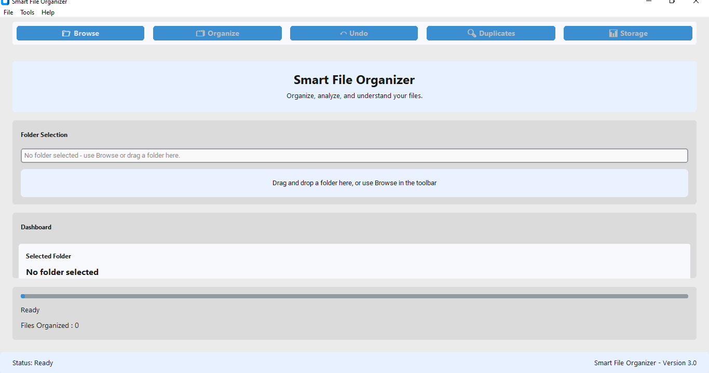
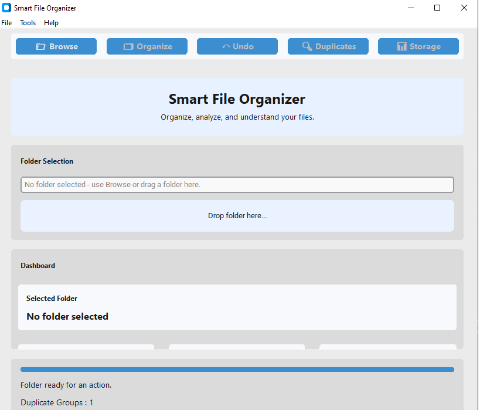
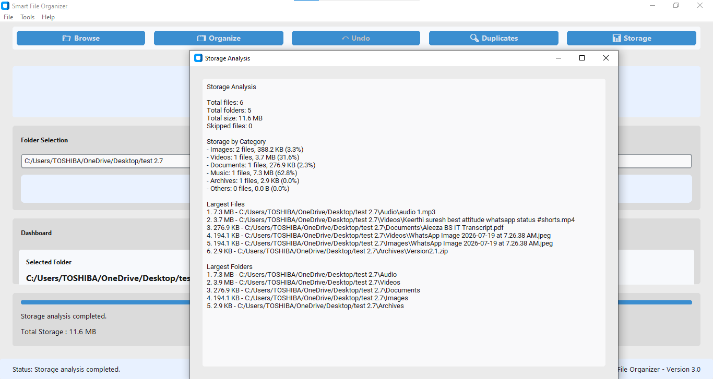
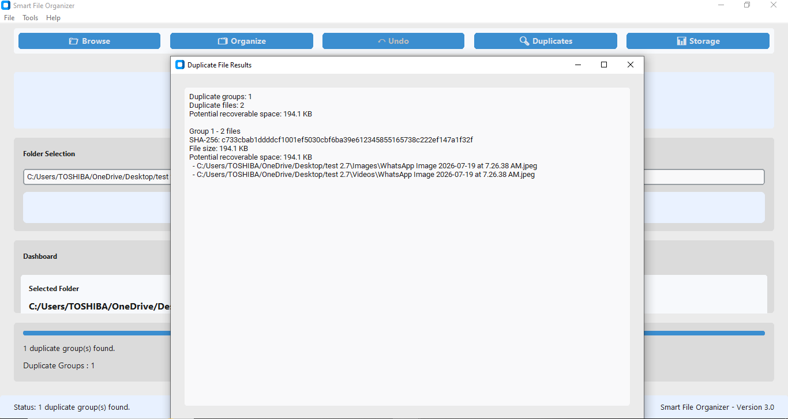
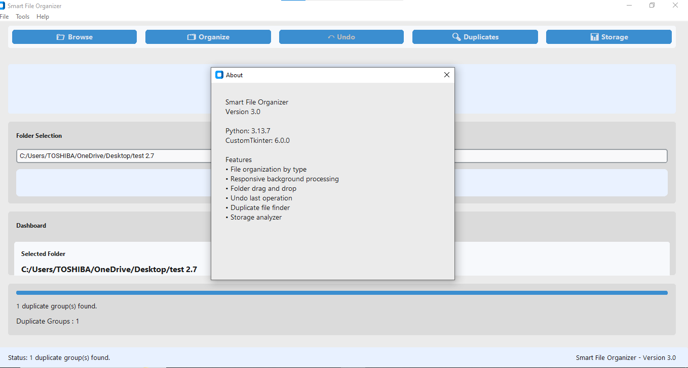
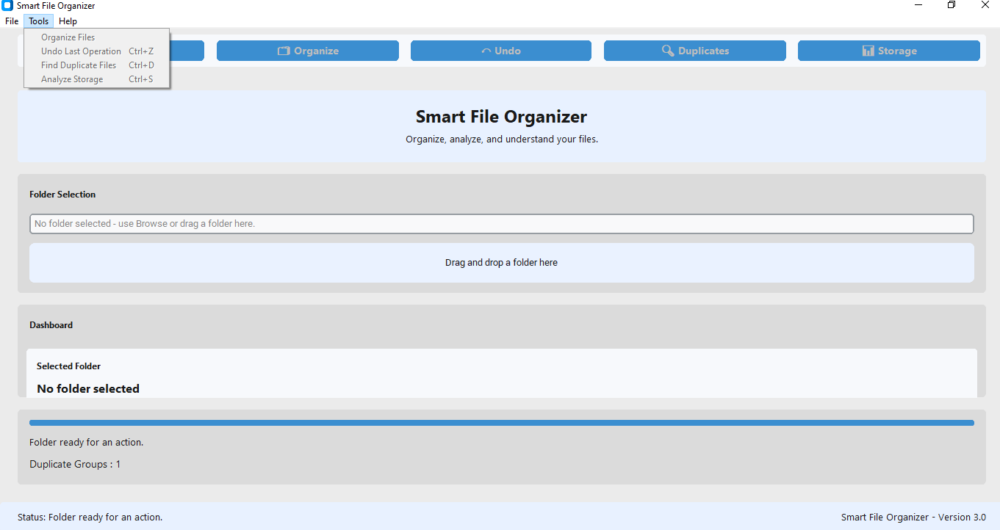

# Smart File Organizer

Smart File Organizer is a Windows desktop application for organizing files, finding duplicates, and understanding folder storage usage. Version 3.0 packages the existing desktop experience for Windows distribution without changing its core file-management behavior.

## Features

- Organize top-level files into type-based folders.
- Responsive background processing with live progress updates.
- Folder selection through Browse or drag and drop.
- Undo the most recent completed organization operation.
- Find duplicate files recursively with size filtering and SHA-256 hashes.
- Analyze recursive storage usage by category, largest files, and largest folders.
- Professional menu bar, toolbar, dashboard, keyboard shortcuts, and status indicators.
- Read-only duplicate and storage-analysis result windows.

## Installation

### Windows executable

1. Download the `SmartFileOrganizer.exe` asset from the [v3.0.0 GitHub Release](https://github.com/developwithah/Smart-File-Organizer/releases/tag/v3.0.0).
2. Run the executable. No Python installation is required.

### Windows installer

When an installer asset is published, download `SmartFileOrganizer-Setup.exe` from the same release and follow the installer prompts.

### Run from source

1. Install Python 3.10 or newer.
2. Clone the repository and open a terminal in the project directory.
3. Install runtime dependencies:

   ```powershell
   python -m pip install -r requirements.txt
   ```

4. Start the application:

   ```powershell
   python main.py
   ```

### Build the Windows executable

1. Install build dependencies:

   ```powershell
   python -m pip install -r requirements-build.txt
   ```

2. Run the build script:

   ```powershell
   .\packaging\build-windows.ps1
   ```

The executable is created at `dist\SmartFileOrganizer.exe`. The script removes prior `build/` and `dist/` output before building.

### Create the installer

1. Install [Inno Setup](https://jrsoftware.org/isinfo.php) on Windows.
2. Build `dist\SmartFileOrganizer.exe` first.
3. Open `installer\SmartFileOrganizer.iss` in Inno Setup and compile it.

The installer output is written to `installer\output\`.

## Screenshots

### 1. Main Window



The main application window provides folder selection, a responsive dashboard, the primary toolbar, and live operation progress.

### 2. Empty State



Before choosing a folder, the interface clearly guides the user to browse for or drag in a folder while file-dependent actions remain unavailable.

### 3. Storage Analyzer



The read-only Storage Analyzer summarizes category usage, total storage, and the largest files and folders.

### 4. Duplicate Finder



The read-only Duplicate Finder presents SHA-256 duplicate groups and potential recoverable space without modifying any files.

### 5. About Dialog



The About dialog identifies Smart File Organizer, Version 3.0, the runtime, and the available features.

### 6. Dashboard / Toolbar



The toolbar provides quick access to common actions, while the dashboard displays the selected folder, analysis metrics, duplicate groups, and current status.

## Technology Stack

- Python
- CustomTkinter
- tkinterdnd2
- Tkinter
- PyInstaller for executable packaging
- Inno Setup for optional Windows installer creation

## Project Structure

```text
Smart-File-Organizer/
├── assets/                    # Real icon and release screenshots
├── docs/                      # Release and regression documentation
├── installer/                 # Inno Setup definition
├── packaging/                 # PyInstaller build script
├── main.py                    # Application entry point
├── ui.py                      # Desktop UI, menus, toolbar, and event coordination
├── organizer.py               # File organization service
├── undo_manager.py            # Undo history service
├── duplicate_finder.py        # SHA-256 duplicate scanning service
├── storage_analyzer.py        # Storage analysis service
├── config.py                  # Application configuration and visual constants
├── utils.py                   # UI helper functions
├── requirements.txt           # Runtime dependencies
├── requirements-build.txt     # Build-only dependencies
├── CHANGELOG.md
└── LICENSE
```

## Future Roadmap

- Publish signed Windows executable and installer assets.
- Add automated unit and UI regression tests.
- Extend undo history to multiple completed operations.
- Add user-configurable organization rules.

## License

This project is licensed under the MIT License. See [LICENSE](LICENSE).
